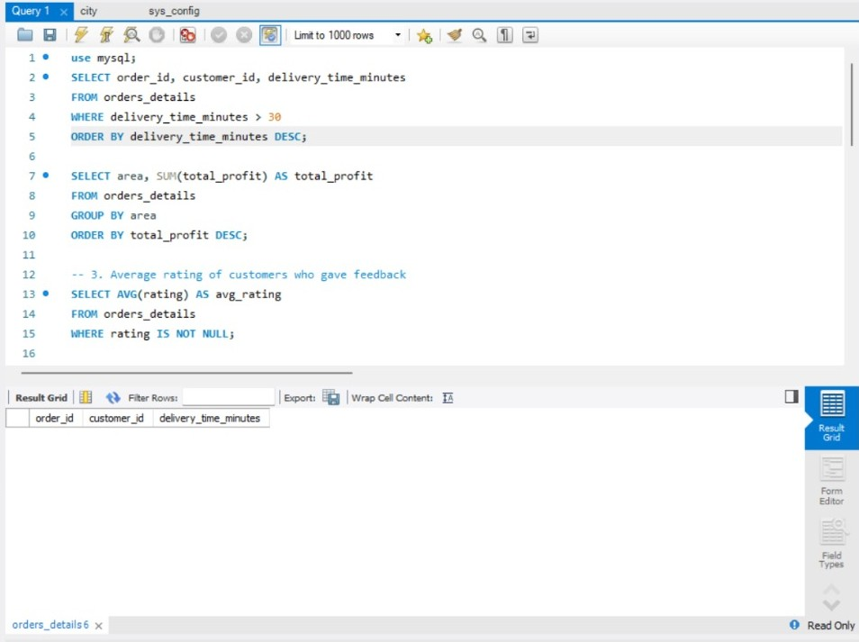
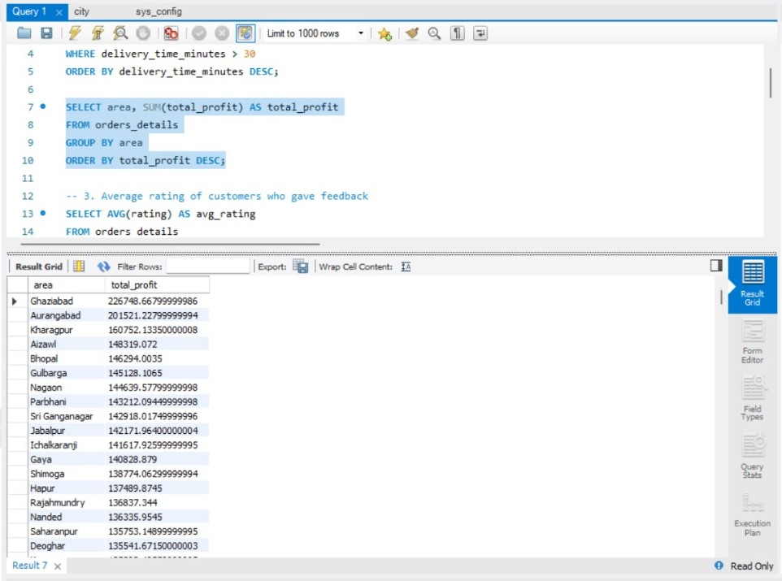
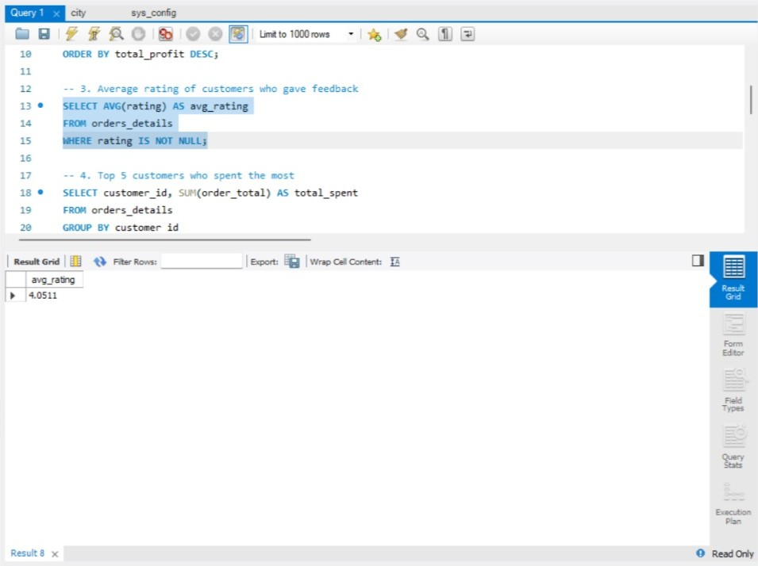
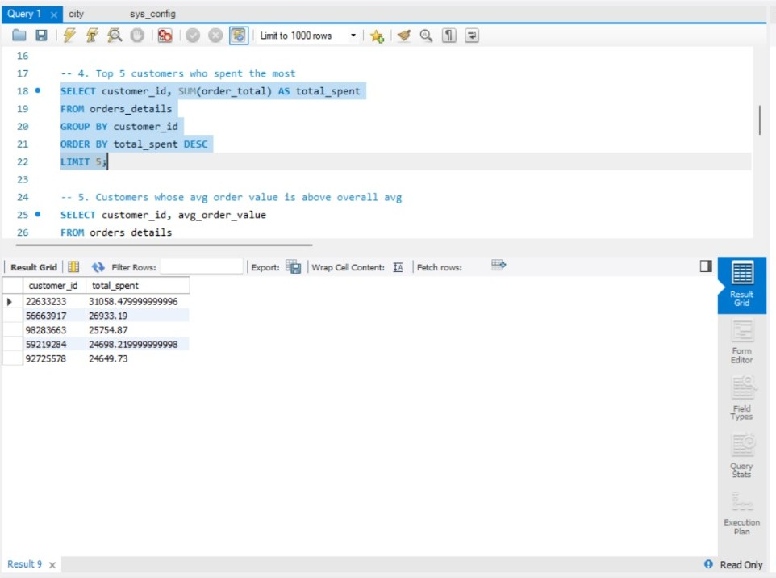
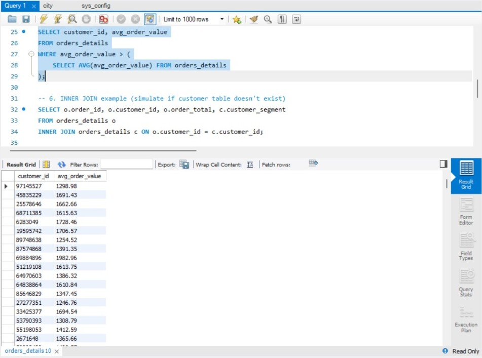
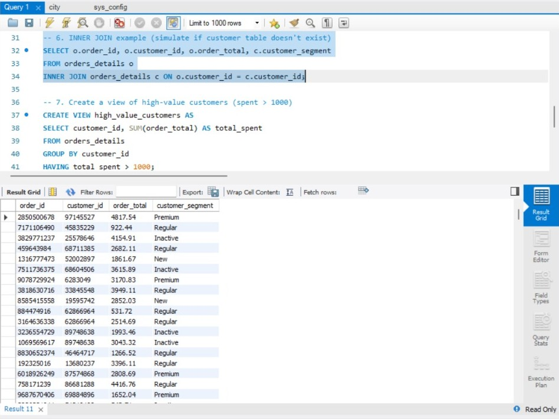
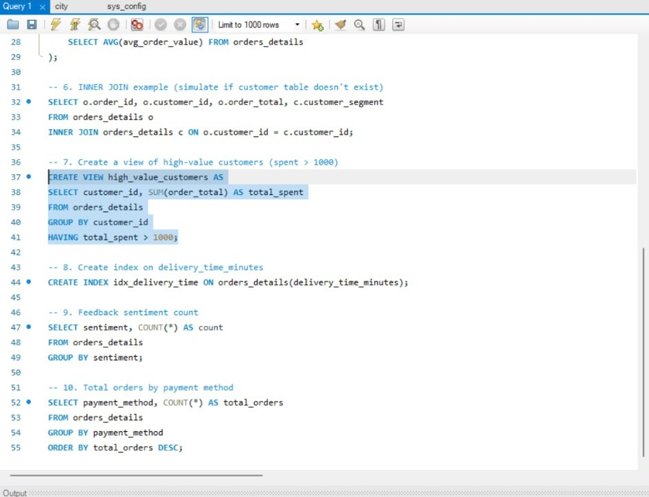
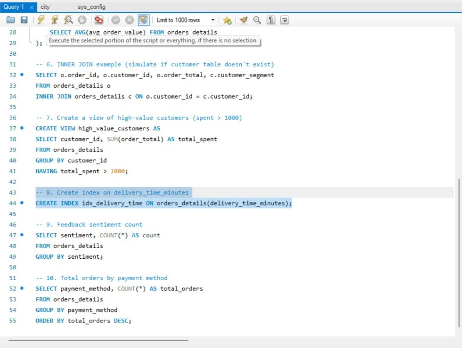
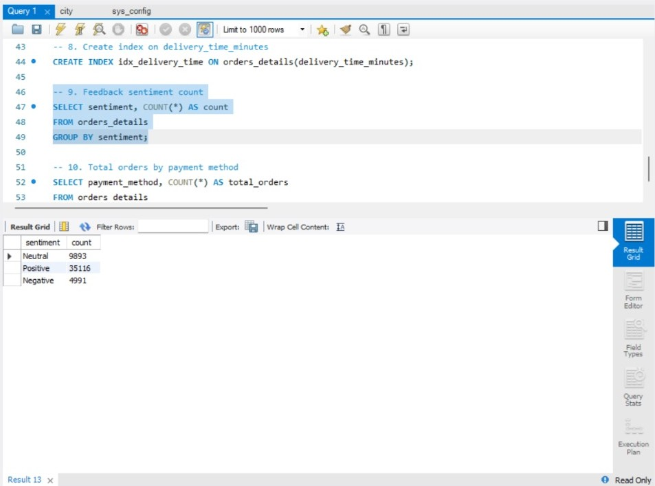
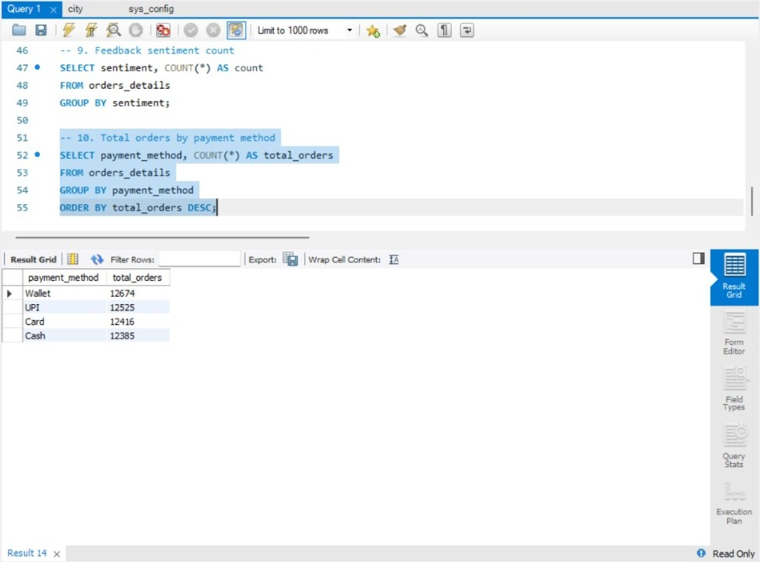

# SQL for Data Analysis

This project focuses on using SQL to extract, manipulate, and analyze ecommerce order data. The goal is to derive meaningful business insights using various SQL techniques.

---

## Dataset Information

* **Name:** `orders_details`
* **Source:** [Glovo-style ecommerce dataset](https://www.kaggle.com/datasets/yassinesadiki/ecommerce-data-of-glovo)
* **File:** `orders_details.csv`
* **Records:** 50k rows
* **Imported to:** MySQL Workbench for querying

---

## Tools Used

* **Database Tool:** MySQL Workbench
* **Query Language:** SQL
* **Output Format:** Screenshots (Result Grid from MySQL)
* **Repository Content:**

  * SQL queries: `task4_queries.sql`
  * Output screenshots: `query1.jpeg` to `query10.jpeg`

---

## Queries 

### 1. Orders delayed more than 30 minutes

```sql
SELECT order_id, customer_id, delivery_time_minutes
FROM orders_details
WHERE delivery_time_minutes > 30
ORDER BY delivery_time_minutes DESC;
```


**Insight:** Identifies orders delayed over 30 minutes to flag delivery issues.

---

### 2. Total profit earned by each area

```sql
SELECT area, SUM(total_profit) AS total_profit
FROM orders_details
GROUP BY area
ORDER BY total_profit DESC;
```


**Insight:** Determines which regions generate the highest profits.

---

### 3. Average rating of customers who gave feedback

```sql
SELECT AVG(rating) AS avg_rating
FROM orders_details
WHERE rating IS NOT NULL;
```


**Insight:** Overall customer satisfaction score is calculated.

---

### 4. Top 5 customers who spent the most

```sql
SELECT customer_id, SUM(order_total) AS total_spent
FROM orders_details
GROUP BY customer_id
ORDER BY total_spent DESC
LIMIT 5;
```


**Insight:** Helps identify and reward high-value customers.

---

### 5. Customers whose avg order value is above overall avg

```sql
SELECT customer_id, avg_order_value
FROM orders_details
WHERE avg_order_value > (
    SELECT AVG(avg_order_value) FROM orders_details
);
```


**Insight:** Filters customers with stronger purchasing power.

---

### 6. INNER JOIN simulation: Order + Customer segment

```sql
SELECT o.order_id, o.customer_id, o.order_total, c.customer_segment
FROM orders_details o
INNER JOIN orders_details c ON o.customer_id = c.customer_id;
```


**Insight:** Demonstrates JOIN usage; could be adapted if a separate customer table existed.

---

### 7. Create a view of high-value customers

```sql
CREATE VIEW high_value_customers AS
SELECT customer_id, SUM(order_total) AS total_spent
FROM orders_details
GROUP BY customer_id
HAVING total_spent > 1000;
```


**Insight:** Enables quick filtering of VIP customers in future queries.

---

### 8. Create index on delivery\_time\_minutes

```sql
CREATE INDEX idx_delivery_time ON orders_details(delivery_time_minutes);
```


**Insight:** Improves speed of queries that filter or sort by delivery time.

---

### 9. Feedback sentiment count

```sql
SELECT sentiment, COUNT(*) AS count
FROM orders_details
GROUP BY sentiment;
```


**Insight:** Summarizes overall sentiment (positive/neutral/negative) from feedback.

---

### 10. Total orders by payment method

```sql
SELECT payment_method, COUNT(*) AS total_orders
FROM orders_details
GROUP BY payment_method
ORDER BY total_orders DESC;
```


**Insight:** Reveals the most used payment options (e.g., Cash, Card, UPI).

---

## Final Analysis Summary

* 10 different queries cover filtering, aggregation, subqueries, joins, indexing, and views.
* Result screenshots validate data insights.
* SQL used to drive business decisions in areas such as:

  * Delivery optimization
  * Customer satisfaction
  * Revenue generation by area
  * Payment preferences

---
## Thank You 

> Created by: **Rajeshwari Agnimandala**  
> June 2025  
